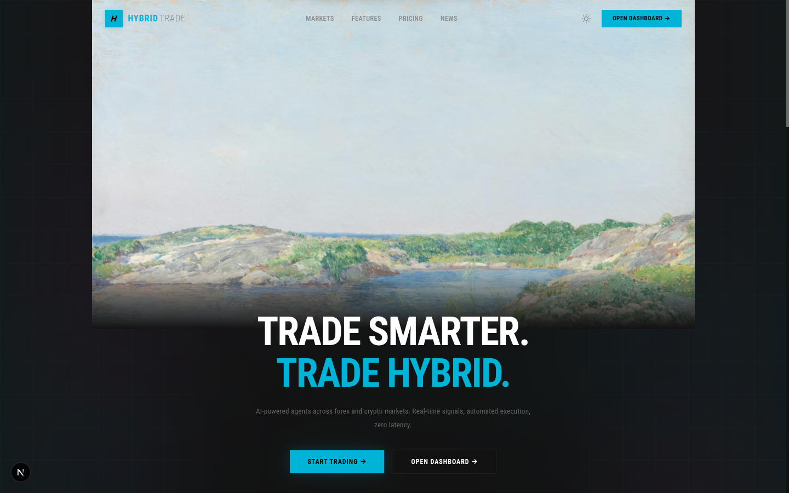
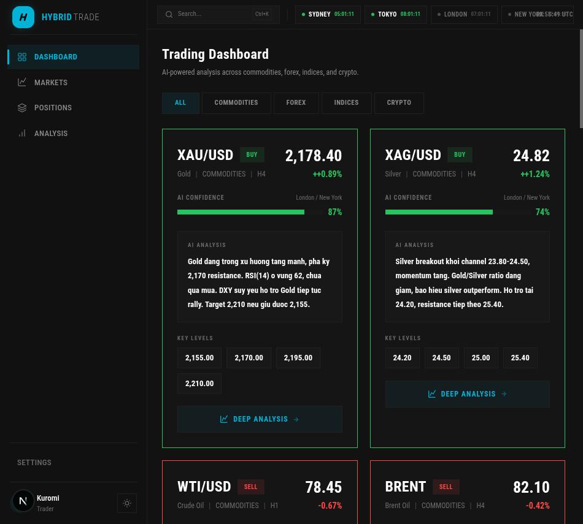
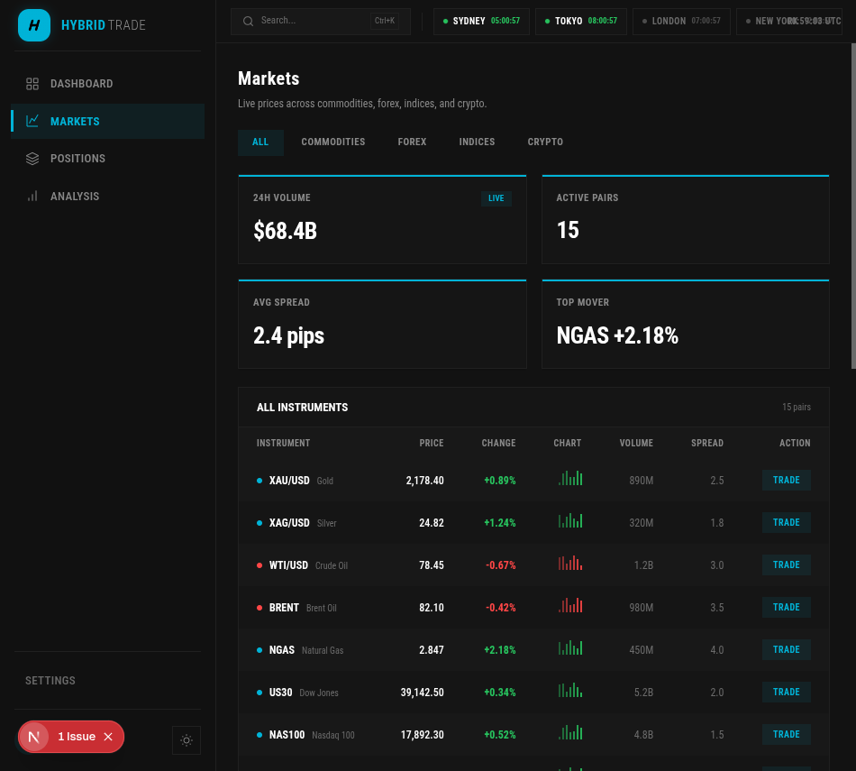
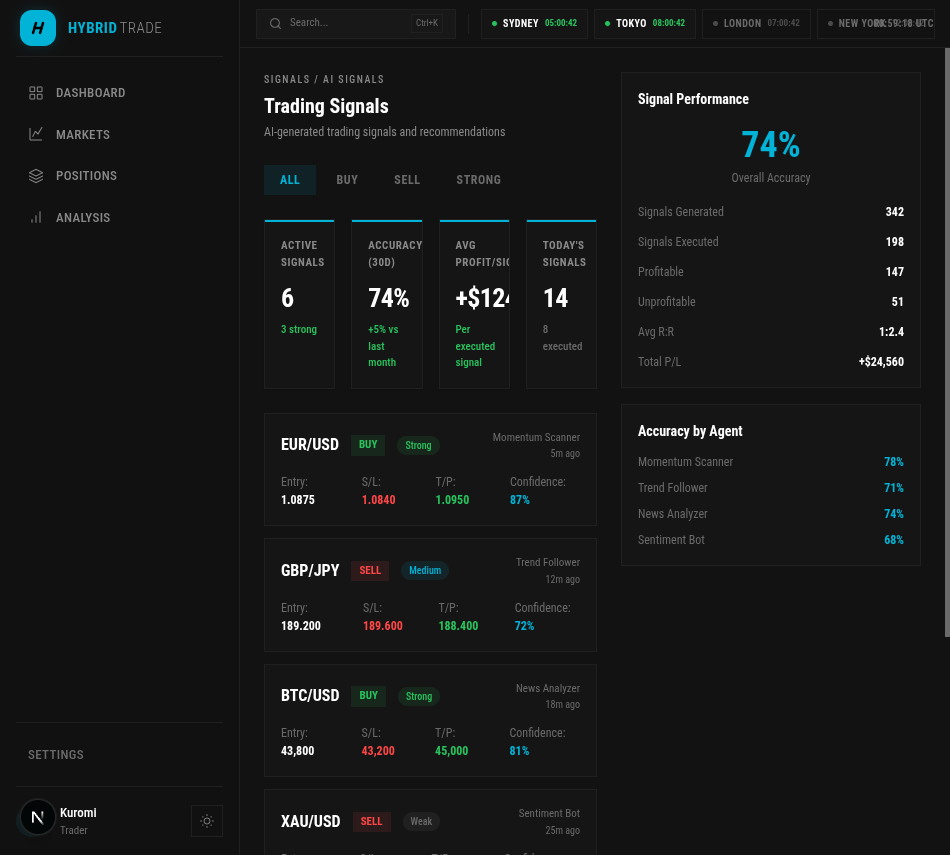

<div align="center">

# HYBRID TRADE

**AI-Powered Multi-Agent Trading Intelligence Platform**

A real-time trading dashboard that leverages autonomous AI agents to analyze forex, commodities, indices, and crypto markets — delivering actionable signals with transparent reasoning.

[](https://nextjs.org/)
[](https://react.dev/)
[](https://tailwindcss.com/)
[](https://www.rust-lang.org/)
[](https://www.typescriptlang.org/)

</div>

---

## Preview

### Landing Page



### Trading Dashboard



### Markets Overview



### AI Trading Signals



---

## Architecture

```
┌─────────────────────────────────────────────────┐
│                  FRONTEND                       │
│         Next.js 16 + React 19 + Tailwind 4      │
│                                                 │
│  ┌──────────┐  ┌──────────┐  ┌──────────────┐  │
│  │ Landing  │  │Dashboard │  │ Investigation│  │
│  │  Page    │  │  Suite   │  │   Workflow   │  │
│  └──────────┘  └──────────┘  └──────────────┘  │
│         │            │              │           │
│         └────────────┼──────────────┘           │
│                      │ SSE / REST               │
├──────────────────────┼──────────────────────────┤
│                  BACKEND                        │
│            Rust · Axum · Tokio                  │
│                                                 │
│  ┌────────────────────────────────────────────┐ │
│  │           AGENT PIPELINE                   │ │
│  │                                            │ │
│  │  Coordinator ──► Source Scout               │ │
│  │       │                │                   │ │
│  │       ▼                ▼                   │ │
│  │  Technical     Evidence Verifier           │ │
│  │  Analyst              │                   │ │
│  │       │               │                   │ │
│  │       └───────┬───────┘                   │ │
│  │               ▼                            │ │
│  │       Report Synthesizer                   │ │
│  └────────────────────────────────────────────┘ │
│                                                 │
│  SQLite · Heartbeats · Scheduler · MCP Tools    │
└─────────────────────────────────────────────────┘
```

## Features

### Trading Dashboard
- **Multi-asset coverage** — Forex, commodities, indices, and crypto in a unified view
- **AI analysis cards** — Each instrument shows AI-generated technical analysis with confidence scores
- **Key levels** — Support/resistance levels highlighted per instrument
- **Session timers** — Live clocks for Sydney, Tokyo, London, and New York sessions
- **Signal filtering** — Filter by asset class, signal strength, and direction (BUY/SELL)

### AI Agent System
- **Coordinator** — Orchestrates investigation workflow and delegates tasks
- **Source Scout** — Discovers and validates information sources from the public web
- **Technical Analyst** — Performs technical analysis with chart pattern recognition
- **Evidence Verifier** — Cross-references findings for accuracy and consistency
- **Report Synthesizer** — Compiles agent outputs into actionable intelligence reports

### Dashboard Pages
| Page | Description |
|------|-------------|
| **Dashboard** | Main trading view with AI-analyzed instrument cards |
| **Markets** | Live prices, volume, spreads across 15 instruments |
| **Positions** | Open position tracking with P/L monitoring |
| **Signals** | AI-generated BUY/SELL signals with entry/SL/TP levels |
| **Agents** | Agent health monitoring and investigation queue |
| **Analytics** | Per-symbol deep analysis with historical data |
| **News** | Aggregated market news feed |
| **Orders** | Order management and execution history |

## Tech Stack

| Layer | Technology |
|-------|-----------|
| **Framework** | Next.js 16 (App Router, Turbopack) |
| **UI** | React 19, Tailwind CSS 4, Motion (Framer Motion) |
| **Charts** | Recharts |
| **Icons** | Lucide, HugeIcons |
| **Theming** | next-themes (dark/light) |
| **Backend** | Rust, Axum, Tokio, SQLx |
| **Database** | SQLite |
| **Streaming** | Server-Sent Events (SSE) |
| **Language** | TypeScript 5.9, Rust |

## Getting Started

### Prerequisites
- Node.js 20+
- Rust toolchain (for backend)

### Frontend

```bash
cd frontend
npm install
npm run dev
```

Open [http://localhost:3000](http://localhost:3000) to see the landing page, or navigate to [/dashboard](http://localhost:3000/dashboard) for the trading interface.

### Backend (optional)

```bash
cd rust
export OPENAI_API_KEY=your_key
export ANTHROPIC_API_KEY=your_key
cargo run -p hybridtrade-server
```

The backend enables the investigation workflow and AI agent pipeline. The frontend trading dashboard works independently with mock data.

## Project Structure

```
HybridTrade/
├── frontend/
│   ├── app/
│   │   ├── page.tsx                 # Landing page
│   │   ├── globals.css              # Theme tokens + Tailwind
│   │   └── dashboard/
│   │       ├── page.tsx             # Main trading dashboard
│   │       ├── markets/             # Live market prices
│   │       ├── positions/           # Position tracking
│   │       ├── signals/             # AI trading signals
│   │       ├── agents/              # Agent monitoring
│   │       ├── analytics/           # Deep analysis
│   │       ├── news/                # News feed
│   │       └── orders/              # Order management
│   ├── components/
│   │   ├── dashboard/               # Sidebar, top-bar, stats, cards
│   │   ├── landing/                 # Hero, philosophy, markets, CTA
│   │   └── ui/                      # Shared UI primitives
│   └── lib/                         # Utils, types, API clients
├── rust/
│   ├── server/                      # Axum backend + agent pipeline
│   ├── agent-cli/                   # Debug CLI for agents
│   └── config/                      # App, MCP, scheduler configs
├── docs/                            # Vietnamese documentation
└── screenshots/                     # UI screenshots
```

## Design

The interface follows a **true-black dark theme** with cyan (#22D3EE) as the primary accent — designed for extended screen time during trading sessions.

- **Typography**: Roboto Condensed — compact, readable at small sizes
- **Color system**: Cyan accent, green for profit, red for loss, amber for warnings
- **Animations**: Motion (Framer Motion) for page transitions, stagger grids, and micro-interactions
- **Layout**: Collapsible sidebar + session-aware top bar with global search (Ctrl+K)

## License

This project is for educational and research purposes.

---

<div align="center">
  <sub>Built with Next.js, Rust, and AI agents</sub>
</div>
